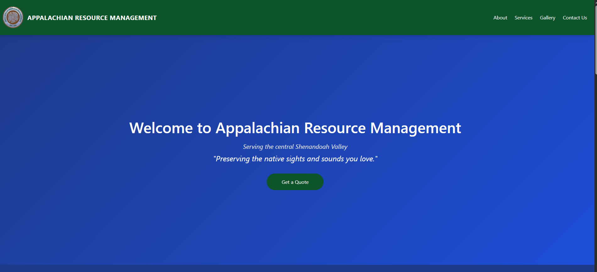

# Appalachian Resource Management 🌿

Welcome to the official web application for **Appalachian Resource Management**, a land management and lawn care service based in the Shenandoah Valley. This modern, mobile-friendly site showcases our services and reflects our mission to preserve the natural beauty of the land we love.

---

## 🚀 Features

- 🌄 **Hero Section**: Gradient background with parallax effect and call-to-action button.
- 🧰 **Services Section**: Animated cards highlighting key offerings with Framer Motion + Parallax scroll effects.
- 📱 **Responsive Design**: Fully optimized for desktop and mobile experiences.
- 🔗 **Smooth Navigation**: Scrolls smoothly between sections using hash links and animation timing.
- 🌿 **Modern Stack**: React + TailwindCSS + Framer Motion + React Scroll Parallax.

---

## 🛠️ Tech Stack

| Tech             | Purpose                        |
|------------------|--------------------------------|
| **React**        | Frontend framework             |
| **Tailwind CSS** | Utility-first styling          |
| **Framer Motion**| Section/card animation         |
| **react-scroll-parallax** | Smooth parallax scroll |
| **Vite**         | Lightning-fast development     |

---

## 📸 Preview

  
> A clean, fast, and professional frontend tailored for land care services.

---


```bash
lawncare-webapp/
└── client/
    └── src/
        ├── assets/               # Logos & images (brians_logo.png, image1.png - image6.png)
        ├── App.jsx               # Main app composition
        ├── main.jsx              # React root mount point
        ├── index.css             # Tailwind base styles and custom styles
        ├── NavBar.jsx            # Top navigation bar with smooth scroll
        ├── HeroSection.jsx       # Parallax Hero section with introductory content
        ├── ServicesSection.jsx   # Parallax & animated service cards (with Framer Motion)
        ├── WhyChoose.jsx         # "Why Choose Us" trust and value proposition section
        ├── Gallery.jsx           # Fully built photo showcase section
        └── ContactUs.jsx         # Final contact card section (location + contact info)
🧪 Local Development
Clone the project and get started:
git clone https://github.com/yourusername/appalachian-resource-management.git
cd appalachian-resource-management
npm install
npm run dev
Site runs on http://localhost:5173 by default.

🎯 Future Plans

✉️ Add contact form with auto email replies

🧠 Admin panel for quote requests (maybe

👨‍💻 Built By
Jacob Henry Sorrells
Junior CS Student | Full Stack Developer
Linkedin- https://www.linkedin.com/in/jacob-henry-sorrells-


